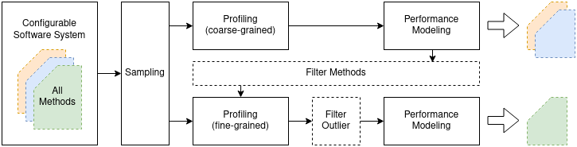

[](https://www.gnu.org/licenses/old-licenses/gpl-2.0.en.html)

# White-Box Performance-Influence Models

We device an approach for medeling configuration-dependent software properties (like performance) at the method level. With these models one can predict the performance of methods given a configuration of a software system.

The approach consists of two steps: First, a coarse-grained profiler (jProfiler) is used to measure the performance of each method that is executed. This is done for different configurations. We then learn performance-influence models for each method.

The second step then focuses on measurement and analyse of a subset of methods. Here, another profiler (Kieker) is used to measure all induvidual method executions, which may result in terrabytes of method execution data, depending on the number of method executions. This data however is summaryzed with histograms, reducing the footprint to few megabytes.

## Overview



We give an overview of our approach in the figure above. We describe the most important steps below.

**Configurable Systems + Sampling**
This approach assumes that a software system has be elected before. Next, a set of configurations is selected by a sampling strategie. As a result from this step, the folder [Subject Systems](supplementary-website/SubjectSystems) contains the binaries and a sets of configurations for the subject systems.

**Profiling (coarse-grained) + Profiling (fine-grained)**
Profiling is done by executing the software systems while collecting performance data via a profiler. Each configuration is executed individually with a new instance of the JVM. We used [jProfiler](https://www.ej-technologies.com/products/jprofiler/overview.html) as the coarse-grained profiler, getting the measured execution time of each individual method of the subject system. We used [Kieker](http://kieker-monitoring.net/), an instrumentation-based profiler, for measuring the execution time for each individual method execution of the set of instrumented methods. The instrumentation is done manually. This profling step may results in large ammounts of data. Therefore, we compressed the results of each program execution during measurement to be able to save the data.

**Filter Methods + Filter Outlier**

(Filter Methods) After learning a model from the coarse-grained data, we decide for each method whether to include it in the second step.

(Filter Outlier) The `abstractprofiler.py` in the `monitoring/monitoring/profiling/` folder implements the outlier filter. This filtering step has to be applied direct after the fine-grained profiling. Each profiling step may produce several terabytes of data. For each method, we remove the 100th percentile of the method calls with regard to execution time.


## Data

Each file in the ```supplementary-website/data/``` folder contains the measurement data of one experiment. Each experiment is defined by the subject system, the sampling strategy, and the profiler. In order to reduce file size, we compressed the experiment files with [gzip](https://wiki.ubuntuusers.de/gzip/).

Files containing ```*__rnd100__*``` belong to the test set of the corresponding subject systems.


## Requirements

### Profiling Performance

Hardware requirements depend on the software system and the workload should be executed in the experiments. We measured 9 real-word Java software systems with 27 desktop computers, each of them equipped with an Intel Quad-Core processor, an SSD running Ubuntu 18.04.03 LTS headless, an HDD to store the profiling data, and 8GB or 16GB of RAM (we grouped the cluster such that each group a consistent amount of RAM).
On each node of the cluster there is `java-8-openjdk` and `Python 3.7.5` installed.


### Learning Method-Level Models

We used an Laptop with an i7-10710U processor, 16GB RAM and 500GB SSD running an Manjaro Linux. To execute the modeling scripts you need to have `Python 3` installed with all python packages listed in the `requirements.txt`.


## Installation

For reproduction of our results, we provide a description for a manual setup showing the steps using a Linux-based operating system to repoduce the results of this work. Before installing we refer to the `REQUIREMENTS.md` to see whether the respective setup meets the requirements.

To run the provided python scripts please install the `requirements.txt` from the `supplementary-website/code/` folder.


## Programs and Scripts

**Profiling a System**

For profiling, it is necessary to have a slurm cluster running. To set up the slurm workload manager we refer to the official guides and tutorials: [Slurm WL](https://slurm.schedmd.com/overview.html). It is necessary to have at least some experience with slurm to run these measurement scripts.
We provide all necessary scripts for profiling a softwaresystem in the ```supplementary-website/code/monitoring/``` directory. The output path has to be defined on the file `supplementary-website/code/monitoring/monitoring/profiling/abstractprofiler.py` as `self.base_output_path = '/tmp/'`. This has to be done only once for the slurm cluster. The file ```supplementary-website/code/monitoring/start_slurm_run.sh``` serves as the startscript that is executed in the slurm master. The interface is:
```
./start_slurm_run.sh <path/to/configurations> <number repetitions> <profiler> <slurm partition>
```
An example call is:
```
./start_slurm_run.sh samplingStrategies/catena/catena_config_feature_pbd_125_5.txt 5 None planck
```
The profiling data has to be processed with the `supplementary-website/code/modeling/monitoringDataParser.py` script. We provide the already parsed data in the ```supplementary-website/data/``` folder. Profiling the execution time of all methods of the subject systems costs us 19 years of CPU time, parsing it costs us several days. Providing our measurement data reduces the time to reproduce the results a lot.


**Generating Method-Level Models**

After cloning this repository, it is necessary to decompress the profiling data (which can be found```supplementary-website/data/```). After that, all necessary scripts to create the performance-influence models can be found in the ```supplementary-website/code/modeling/``` folder. The following shows the CLI and an example call of the script.
```
learn_method_level_model.py <in_file> <eval_file> <output_path>
learn_method_level_model.py ./../../experiment_data/data/density-converter__t_2_pbd_49_7__jProfiler.pkl.gz ./../../experiment_data/data/density-converter__rnd100__jProfiler.pkl /tmp/
```
The results will be written to the `<output_path>` folder. The `<in_file>` and the `<eval_file>` have to be profiling data files, generated with the `monitoringDataParser.py`. Note that there are files that are profiled additionally as test sets (`*__rnd100__*`). These files exist for each subject system and profiler.
